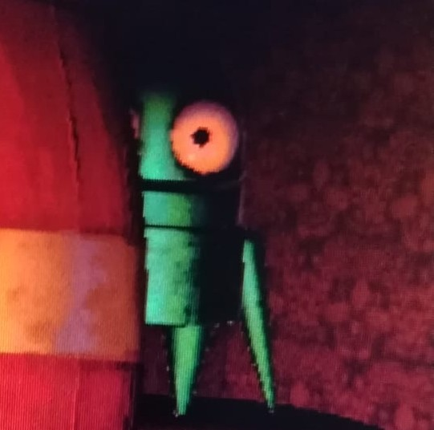

# Semibots Nightmare



**Descripción del Proyecto**
Juego en 2d de exploracion y terror, donde tu como un semibot debes encontrar los restos de tus colegas caidos para reconstruirlos, pero cuidado, los peligros acechan en cada esquina, lo que haya hecho caer a tus compañeros todavia sigue rondando por estos lares.

**🎯 Objetivo del Juego**
-Encontrar los restos de tus compañeros
-Escapar de las instalaciones donde te encuentras
-Sobrevivir

**🎮 Controles**
Lista los controles:
A/D: Movimiento 
W: Saltar
Ctrl izquierdo: agacharse
Shift izquierdo: correr

**⚙️ Mecánicas**
-Movimiento entre habitaciones
-Saltar
-Agacharse
-Correr

**🏆 Características**
-Juego 2D
-Retro

**👥 Equipo**
Líder: Set Samir Barragan Araiza (Set-Samir-Barragan-Araiza)

**🛠️ Tecnologías**
**Motor/Framework:** 
Lenguaje: C++
Librerías adicionales: DevTools, SFML, Box2D 

**📜 Créditos**
**Assets de terceros utilizados:**
freesound / TechspiredMinds / Footsteps Gravel/Rock/Pebbles 4/8
https://freesound.org/people/TechspiredMinds/sounds/729199/

**Referencias o inspiraciones:**
Tome de referencia el juego de R.E.P.O. para el diseño en general y lo mezcle con el estilo de los minijuegos de Five Nights At Freddys.

**Agradecimientos:**
- TechspiredMinds
- Semiwork
--
**Información Complementaria**
--
**Características principales**

- Movimiento lateral con teclas `A` / `D`.
- Agachado con `Left Ctrl`.
- Animación de caminar (dos frames) y sprite de idle.
- Escalado uniforme por altura objetivo para mantener proporciones.
- Superposición en pantalla con ayuda gráfica (`GamesButtons.png`) que indica los controles.
- Integración de efectos de sonido para pasos (si `assets/sound/footsteps.*` está presente).

--

**Requisitos**

- Compilador C++ compatible con C++17 (`g++`, `clang++`, MSVC).
- SFML (graphics, window, system, audio) instalada o disponible como DLLs en `bin/`.
- Make (opcional) para facilitar la compilación.

En Windows puedes usar MinGW/WSL/Visual Studio; en Linux instalar `libsfml-dev` vía tu gestor.

--

**Estructura del proyecto**

- `src/` — archivos fuente C++.
- `include/` — encabezados (clases: `Pantalla`, `Semibot`, `WalkAnimation`, `Direccion`, ...).
- `assets/` — recursos: `images/`, `fonts/`, `sound/`.
- `bin/` — binarios y objetos generados por la compilación.
- `scripts/` — helper scripts (copiar DLLs, etc.).

--

Cómo compilar y ejecutar

1) Desde un entorno POSIX (Linux, WSL, MinGW/MSYS):

```bash
make
./bin/app.exe   # en Windows con MinGW o en WSL
```

2) En Windows (cmd / Powershell) si `bin/app.exe` ya fue creado:

```powershell
.\bin\app.exe
```

Notas:
- Si faltan DLLs de SFML en Windows, ejecuta `sh scripts/copy_sfml_dlls.sh "" bin` desde MSYS/MinGW o copia manualmente las DLLs al directorio `bin/`.
- El Makefile está preparado para compilar los objetos en `bin/objs` y enlazar `bin/app.exe`.

--

Controles del juego

- Mover izquierda/derecha: `A` / `D`.
- Agacharse: `Left Ctrl`.
- En el menú de inicio: `Enter` para comenzar.

--

Assets importantes

- `assets/images/FondoChimenea.png` — fondo principal (usado como 'suelo').
- `assets/images/SemibotParadoDerecha.png`, `SemibotParadoIzquierda.png` — frames de idle.
- `assets/images/SemibotPaso1*.png`, `SemibotPaso2*.png` — frames de caminar.
- `assets/images/GamesButtons.png` — imagen explicativa de controles (mostrada sobre el semibot).
- `assets/sound/footsteps.wav` u `.ogg` — sonido de pasos (opcional).

Puedes reemplazar estas imágenes manteniendo los mismos nombres para que el código las detecte automáticamente. Si usas distintos nombres, actualiza las llamadas en `include/Direccion.hpp`.

--

Detalles técnicos y notas para desarrolladores

- `Semibot` gestiona texturas, animaciones y entrada. La escala se calcula por altura objetivo en píxeles (`setIdleSizePixels`) para evitar compresión horizontal.
- `WalkAnimation` es una animación simple de dos frames que recalcula origen y escala al cambiar de frame para mantener los pies alineados al suelo.
- La pantalla de ayuda ahora se dibuja sobre el semibot desde `Pantalla::run()` y desaparece después de unos segundos.

Depuración rápida

- Para ver mensajes de depuración temporales (si aún existen), ejecuta el binario desde una consola para ver la salida estándar.
- Si la app no inicia, verifica la presencia de las DLLs de SFML en `bin/` o instala SFML en tu sistema.

--

Contribuciones

1. Haz un fork del repositorio.
2. Crea una rama feature/bugfix.
3. Haz tus cambios y abre un pull request con descripción clara.

Por favor incluye capturas si el cambio afecta a la UI/animaciones.

--
**Muchas gracias por visualizar este proyecto!!**


